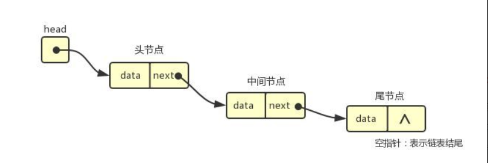
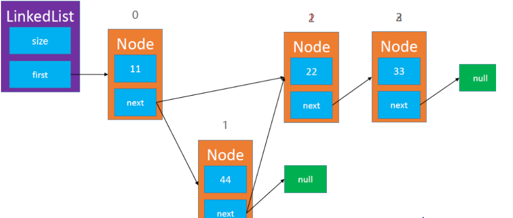
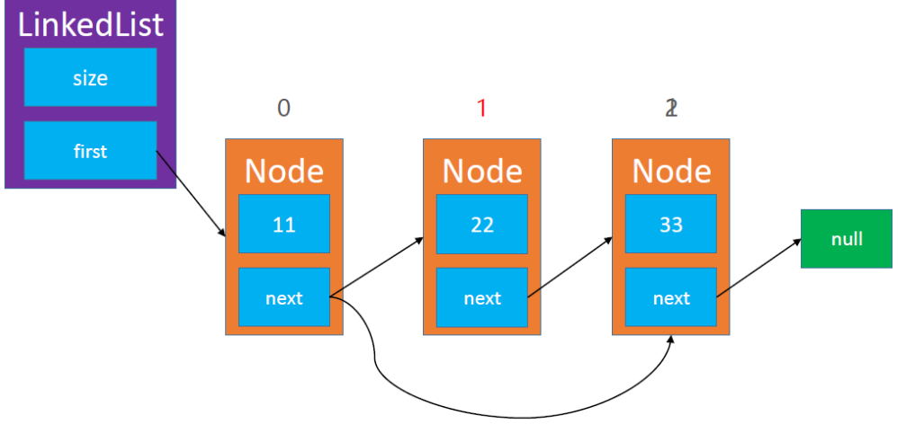

# 单向链表（SingleList）

动态数组有个明显的缺点：

- 可能会造成内存空间的大量浪费。

能否用到多少就申请多少内存？

- 链表可以办到这一点

**链表**是一种**链式存储**的线性表，所有元素的**内存地址不一定是连续的**;



# 链表的设计

* **每个节点具有一个指针域和一个数据域**

## 单向链表的节点

```cpp
emplate<typename E>
struct Node {
	E element; //数据域
	Node<E>* next;//指针域
	
public:
	Node() {
		element = E();
		next = nullptr;
	}
	Node(E e, Node<E>* p) {
		this->element = e;
		this->next = p;
	}
};
```

## 单向链表接口设计


```cpp
template<typename E> //节点设计
struct Node {
	E element;
	Node<E>* next;
	
public:
	Node() {
		element = E();
		next = nullptr;
	}
	Node(E e, Node<E>* p) {
		this->element = e;
		this->next = p;
	}
};

template<typename E>
class SingleList { 
private:
	Node<E>* first; //如图的head指针
	int count;//统计链表的元素个数
public:
	static const int ELEMENT_NOT_FOUND; //没有找到元素时，默认返回值
public:
	//构造/析构函数
	SingleList();
	SingleList(int c, Node<E>* p);
	~SingleList();

	
	//普通函数
	void clear();
	int size();
	bool isEmpty();
	bool contains(const E& element);

	void push_front(const E& element);
	void push_back(const E& element);
	int indexOf(const int& element);
	Node<E>* node(const int& index); //获取index位置节点，并返回指针
	void insert(const int& index, const E& element); //在index位置处插入元素element

	E pop_front();
	E pop_back();
	E remove(const int& index);//将index位置处的元素删除并且返回该值

	E get(const int& index);
	E set(const int& index, const E& element);


	void printSingList();
private: //边界检查函数
	void outOfRang(const string& s); 
	void rangCheck(const int& index);
	void rangCheckForAdd(const int& index);
	
};
```


## 构造函数和析构函数

```cpp
//构造/析构函数
template<typename E>
SingleList<E>::SingleList() {
	this->count = 0;
	this->first = nullptr;
}

template<typename E>
SingleList<E>::SingleList(int c, Node<E>* p) {
	this->count = c;
	this->first = p;
}

```


## 边界检查函数

```cpp
template<typename E>
void SingleList<E>::outOfRang(const string& s) { //边界错误时抛出异常
	std::cout << s << std::endl;

}

template<typename E>
void SingleList<E>::rangCheck(const int& index) {
	if (index < 0 || index >= this->count)
		this->outOfRang("index <0 || index >= count");
}

template<typename E>
void SingleList<E>::rangCheckForAdd(const int& index) {
	if (index < 0 || index > this->count)
		this->outOfRang("index < 0 || index > count ");
}
```


## 一般属性的函数

```cpp
template<typename E>
void SingleList<E>::clear() { 
	while (first) {
		Node<E>* tmp = first;
		first = first->next;
		delete tmp;
	}
	this->count = 0;
	this->first = nullptr;
}

template<typename E>
int SingleList<E>::size() {

	return this->count;
}

template<typename E>
bool SingleList<E>::isEmpty()
{

	return this->count == 0;

}

template<typename E>
bool SingleList<E>::contains(const E& element) {

	return this->indexOf(element) != this->ELEMENT_NOT_FOUND;
}
```


## 根据索引获得对应元素的指针

```cpp
template<typename E>
int SingleList<E>::indexOf(const int& element) {

	Node<E>* current = this->first;
	for (int i = 0; i < this->count; ++i) {
		if (element == current->element) return i;
	}

	return this->ELEMENT_NOT_FOUND;

}
```


## 根据元素的值获取元素的下标

```cpp
template<typename E>
int SingleList<E>::indexOf(const int& element) {

	Node<E>* current = this->first;
	for (int i = 0; i < this->count; ++i) {
		if (element == current->element) return i;
	}

	return this->ELEMENT_NOT_FOUND;

}
```


## 添加元素

## 

**注意在0位置插入元素的情况**

```cpp
template<typename E>
void SingleList<E>::push_front(const E& element) {

	this->insert(0, element);

}


template<typename E>
void SingleList<E>::push_back(const E & element) {

	this->insert(this->count, element);
}


template<typename E>
void SingleList<E>::insert(const int& index, const E& element) //在index位置处插入元素element
{
	this->rangCheckForAdd(index);
	if (index == 0) {//在0位置插入的情况
		first = new Node<E>(element, first);
	}
	else {
		Node<E>* prev = this->node(index - 1); 
		Node<E>* newnode = new Node<E>(element, prev->next);
		prev->next = newnode;
	}
	++this->count;
}
```


## 删除元素



* **注意首元素删除时，末尾元素删除时，只有一个元素删除时**

```cpp

template<typename E>
E SingleList<E>::pop_front() {

	if (this->count == 0)
		abort();
	Node<E>* temp = this->first;
	this->first = temp->next;
	E ret = temp->element;
	delete temp;
	--this->count;
	return ret;

}

template<typename E>
E SingleList<E>::pop_back()
{
	if (this->count == 0)
		abort();
	Node<E>* temp = this->node(this->count - 1);
	E ret = temp->element;
	temp = nullptr;
	this->remove(this->count - 1);


	return ret;


}

template<typename E>
E SingleList<E>::remove(const int& index)//将index位置处的元素删除并且返回该值
{
	this->rangCheck(index);
	Node<E>* node = first;
	if (index == 0) {
		first = first->next;
	}
	else {
		Node<E>* prev = this->node(index - 1);
		node = prev->next;
		prev->next = node->next;
	}
	E ret = node->element;
	delete node;
	--this->count;
	return ret;
```


## 获取，设置，打印函数

```cpp
template<typename E>
E SingleList<E>::get(const int& index) {

	return this->node(index)->element;

}


template<typename E>
E SingleList<E>::set(const int& index, const E& element) {

	Node<E>* node = this->node(index);
	E ret = node->element;
	node->element = element;
	return ret;


}


template<typename E>
void SingleList<E>::printSingList() {
	Node<E>* current = first;
	while (current) {
		std::cout << current->element << " -> ";
		current = current->next;
	}
	std::cout << "NULL" << std::endl;
}
```

