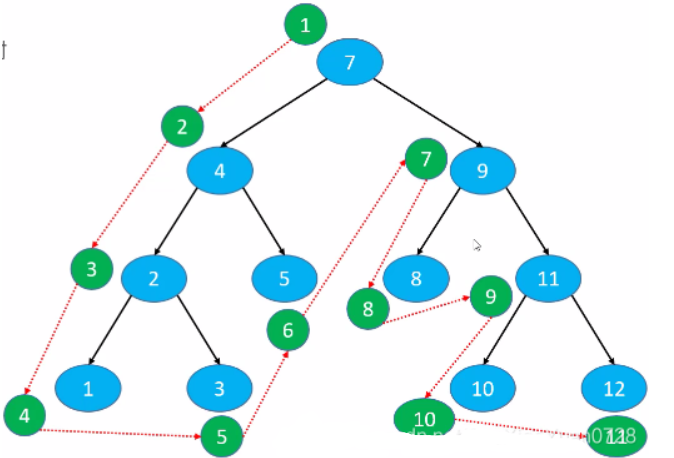
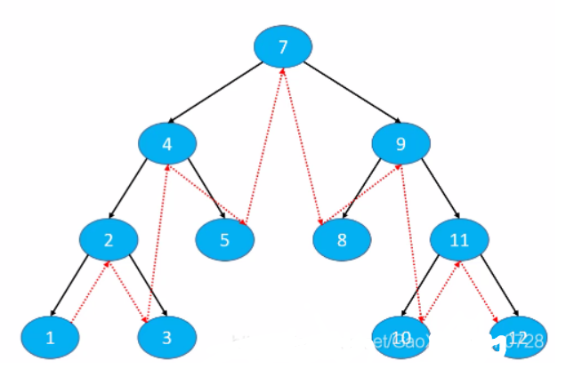
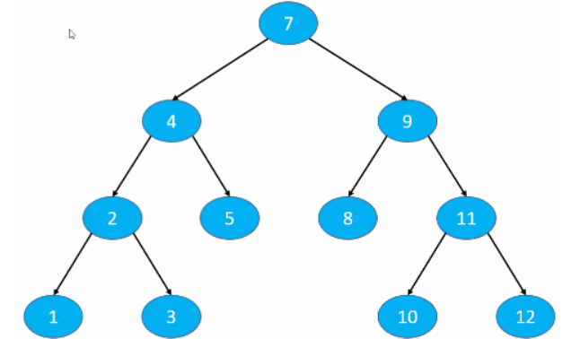
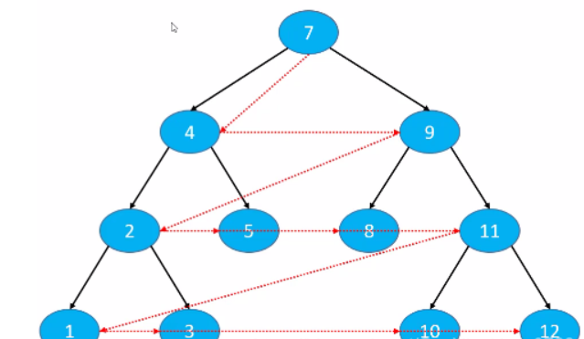
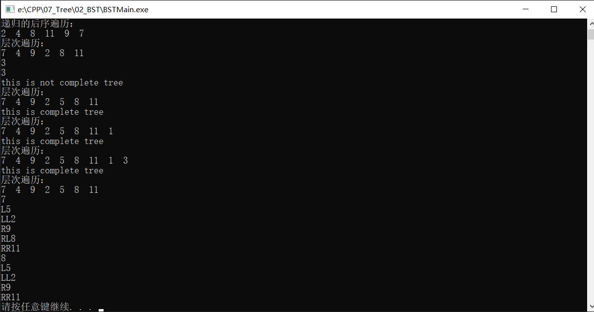
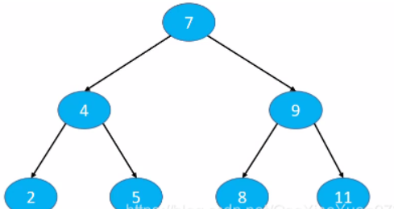
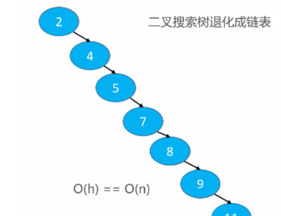

# 二叉搜索树（C++）

## 一、背景

当我们在应用在n个动态整数当中搜索某个整数的时候会有几种方法  
①使用动态数组，平均时间复杂度为O\(n\)  
②使用一个有序的动态数组，使用二分搜索法，虽然它的最坏时间复杂度只有O\(logn\)，但是它的添加、深处的平均时间复杂度过高，为O\(n\)。  
  
③使用链表与使用动态数组无太大差别，都需要从第一个元素开始搜索，平均时间复杂度也为O\(n\)，过高。

因此我们考虑是否有更为优化的方针  
接下来就引出**二叉搜索树，其将数据有序排放，搜索的最坏复杂度为O\(logn\)，因为采用链表中的方法将数据连接，添加、删除等方法的最坏时间复杂度也优化为O\(logn\)。**

## 二、简介

二叉搜索树（Binary Search Tree）是二叉树的一种**，简称BST，又被称为二叉查找树，二叉排序树**。其特点是：  
①**任意一个节点的值都大于其左子树所有节点的值**  
②**任意一个节点的值都小于其右子树所有节点的值**  
③**其左右子树也是一棵二叉搜索树**

首先是二叉搜索树的创立，我们使用了模板这一方法使代码更完备化，任何类型的数据都可以放入搜索树中。  
在节点的创立中，在元素和左右子节点的基础上增加了父节点这一成员方面后面代码的实现。在成员函数中也增加了是否为叶子节点和是否有两个子节点的函数，因为在后期的应用中较多的使用了这些判断，所以对其进行了封装。

在二叉搜索树的创立中只使用了元素个数和根节点这两个元素，就已经能够比较完整的实现了整个代码。而成员函数的实现分为两大块，一个是面向对象放在public区的函数供对象使用，一个是为了更好的实现函数封装放在private区。

**本文的二叉搜索树在最基础的增加、删除、元素数量、是否为空、清空、搜索之外增加了前序、中序、后续、层序四大遍历方法，利用递归和迭代两种算法实现了求二叉树的高度并完成了检查是否是完全二叉树的实现。**

## 三、解析

接下来对二叉搜索树的几个函数进行分析。

### 1、添加

添加时要分为两种情况：  
①**添加的是根节点 ：直接利用构造函数给根节点赋值**  
②**添加的不是根节点：要确定添加节点的位置而且还要增加节点间的连接**


**而要确定添加节点的位置就要不断的那这些节点和增加的数据进行比较，最后找到空节点再放入。因此我们增加了 compare\(\)内部函数**

因为我们定义的是一个泛型的类，可以传入任何数据类型，而且返回值需要是int数据类型，因此对于比较我们要考虑较为全面。  
对于整型和字符型我们可以直接进行相减来检测其与0的关系来比价其大小。但是对于浮点数类型相加减后依旧是浮点数类型，直接进行相减可能会有数据的误差，因此我们使用floor\(\) 向下取整和ceil\(\)向上取整的函数对其进行处理。

下面是 `int compare(E e1,E e2)`函数的代码。

### compare()函数

```cpp
template<typename E>
int BST<E>::compare(const E& e1, const E& e2)// 比较该值和树中节点的值
{
    return e1 - e2;
}
```

add\(\)方法的实现比较简单，直接看代码后的注释就可以大概理解。

下面是 `void add(E element)`函数的代码。

```cpp
template<typename E>
void BST<E>::add(const E& e) // 生成该二叉搜索树的节点 ， 添加到树中
{
    

    if(this->root == nullptr){
        root = new Node<E>(e, nullptr);
        ++this->count;
        return ;
    }
    Node<E>* tmp = root; // 利用tmp 找到对应的插入节点的位置 
    Node<E>* parent = nullptr; // 插入节点的父节点
    int cmp = 0;
    while(tmp != nullptr){
        cmp = this->compare(e , tmp->element);
        parent = tmp;
        if(cmp > 0){
            tmp =  tmp->rchild;
        }else if(cmp < 0) 
        { 
            tmp = tmp->lchild;
        }else{ // 二叉树里面有对应的值节点， 进行覆盖节点的data域
            tmp->element = e;
            return ;
        }
    }
    Node<E>* newnode = new Node<E>(e,parent );
    if(cmp < 0){
        parent->lchild = newnode;
    }else{
        parent->rchild = newnode;
    }
    ++this->count;

}
```

### 2、遍历

四大遍历方法：

#### ①前序遍历\(Preorder Traversal\):

访问顺序：根节点->前序遍历左子树->前序遍历右子树  
  
根据上图的数据我们的访问顺序为：  
因为7为根节点，访问其左子树便为4，再以4作为根节点，访问其左子树便为2，再以2作为根节点，访问其左子树便为1，1无子节点遍开始访问2的右子树3，以此类推，就可推导出全部的访问顺序。  
**7->4->2->1->3->5->9->8->11->10->12**  


根据上文的推导我们很容易的想到递归  
首先实现对于前序遍历函数的接口函数

下面是 `preorder( Node<E>* node)`函数的代码。

```cpp
template<typename E>
void BST<E>::preorder( Node<E>* node)//前序遍历
{

    if(node == nullptr){
        return;
    }
    std::cout << node->element << "  " ;
    this->preorder(node->lchild);
    this->preorder(node->rchild);


}
```

然后再来实现面向对象的前序遍历函数

下面是 `preorder(()`函数的代码。

```cpp
template<typename E>
void BST<E>::preorder()//前序遍历
{

    std::cout << "递归的前序遍历：" <<std::endl;
    this->preorder(root);
    std::cout << std::endl;

}
```

#### ②中序遍历（Inorder Traversal）：

访问顺序：中序遍历左子树->根节点->中序遍历右子树（左右顺序可颠倒）

  
根据上图的数据我们的访问顺序为：  
先访问左边则先访问根节点7的左子树，然后再以4为根节点则访问其左子树2，然后再以2为根节点访问其左子树1，此时1无左子树因此第一个访问1，接下来访问1对应的根节点2，再访问右子树3…以此类推可以推导出全部的访问顺序。  
1->2->3->4->5->7->8->9->10->11->12  
  
根据遍历结果我们可以发现访问出来的元素是从小到大的结果。其实也很容易理解，因为二叉搜索树的元素拜访顺寻本就是若是遇见比自己小的元素则放在左侧，若是比自己大则反之，中序遍历按照从左子节点到根节点再到右子节点便自然而然是从小到大的顺序。以此类推，若是我们的中序遍历的访问顺序写的是：中序遍历左子树->根节点->中序遍历右子树，那么遍历结果就是所有元素的从大到小的顺序。  
与前序遍历一样，中序遍历采用的方法也是递归的算法

下面是 `inorder(Node<E>* node)`函数的代码。

```cpp
template<typename E>
void BST<E>::inorder(Node<E>* node)//中序遍历
{
    if(node == nullptr)
        return ;
    this->inorder(node->lchild);
    std::cout << node->element <<"  ";
    this->inorder(node->rchild);


}
```

然后再来实现面向对象的中序遍历函数

下面是 `inorder()`函数的代码。

```cpp
template<typename E>
void BST<E>::inorder()//中序遍历
{
    std::cout << "递归的中序遍历：" <<std::endl;
    this->inorder(root);
    std::cout << std::endl;


}
```

#### ③后序遍历（Postorder Traversal）：

访问顺序：后序遍历左子树->后序遍历右子树->根节点（左右顺序可颠倒）  
  
根据上图的数据我们的访问顺序为：  
先访问左边则先访问根节点7的左子树，然后再以4为根节点则访问其左子树2，然后再以2为根节点访问其左子树1，此时1无左子树因此第一个访问1，接下来访问1对应的根节点的右子树3，再访问根节点2…以此类推可以推导出全部的访问顺序。  
1->3->2->5->4->8->10->12->11->9->7  


与前两个一样依旧是递归的算法

下面是 `postorder(Node<E>* node)`函数的代码。

```cpp
template<typename E>
void BST<E>::postorder(Node<E>* node)//后序遍历
{
    if(node == nullptr)
        return ;
    this->postorder(node->lchild);
    this->postorder(node->rchild);
    std::cout << node->element << "  ";


}
```

然后再来实现面向对象的后序遍历函数

下面是 `postorder()`函数的代码。

```cpp
template<typename E>
void BST<E>::postorder()//后序遍历
{

    std::cout << "递归的后序遍历：" <<std::endl;
    this->postorder(root);
    std::cout << std::endl;

}
```

#### ④层序遍历（Level Order Traversal）：

访问顺序：从上到下、从左到右一次访问每一个节点  
  
根据上图的数据我们的访问顺序为：  
第一层7，再访问第二层4、9…以此类推可以推导出全部的访问顺序  
7->4->9->2->5->8->11->1->3->10->12  
  
可以明显的观测到此遍历方法不再适合使用递归的算法。因为我们访问第一层7后再访问第二层4和9，第三层的访问顺序也是先访问4的子树点再访问9的子节树，第四层也是如此，意味着前面我们先访问的是哪一个后面我们就先访问哪一个的子节点。也就是先进先出的思想，因此我们可以考虑之前所学的存储结构：队列。  
实现思路：使用队列  
1.将根节点入队  
2.循环执行以下操作，直到队列为空  
⚪将队头节点A出队，进行访问  
⚪将A的左子节点入队  
⚪ 将A的右子节点入队

下面是 `Level_Oreder_Traversal()`函数的代码。

```cpp
template<typename E>
void BST<E>::levelorder(Node<E>* node)//层次遍历
{
    if(node == nullptr)
        return ;
    Node<E>* tmp = nullptr;
    std::queue<Node<E>*> s;
    s.push(root);
    while(!s.empty()){
        tmp = s.front();
        s.pop();
        if(tmp->lchild != nullptr){
            s.push(tmp->lchild);
        }
        if(tmp->rchild != nullptr){
            s.push(tmp->rchild);
        }
        std::cout << tmp->element << "  ";
    }


}

```

当我们掌握的这四个遍历方法，我们可以根据这些遍历来实现其它的功能例如：计算二叉树的高度、判断是否为完全二叉树、删除某个节点…接下来我们就用这些方法来实现。

### 3、求二叉树的高度

#### 递归算法

二叉树的高度本质上就是根节点的高度，高度也就是当前节点到最远叶子所经历的节点数量。因此我们再写一个获取某一个节点高度的接口来实现求二叉树的高度。

如果某个节点不为空，那么其高度就是其左右子节点当中最大的数再加一。逐次递归就可以求出一个节点的高度。

  
例如节点4的高度就是节点2和者节点5中高度大的值加一，节点2的高度是左右子节点的最大高度，节点1和3的无子节点所以高度都为1 ，因此节点2的高度为2，节点5无左右子节点因此高度是1，因此节点4的高度为3…以此类推就可以退出根节点的高度

下面是 `height(Node<E>* node)`函数的代码。

```cpp
template<typename E>
int BST<E>::height2()//递归求二叉树的高度
{

    return this->height(root);


}

template<typename E>
int BST<E>::height(Node<E>* node)//递归求二叉树的高度
{

   if(node == nullptr)
        return 0;
    return std::max(this->height(node->lchild) , this->height(node->rchild)) + 1;


}
```

然后再来实现面向对象的前序遍历函数  
下面是 `height2()`函数的代码。

```cpp
template<typename E>
int BST<E>::height2()//递归求二叉树的高度
{

    return this->height(root);


}
```

#### 迭代算法

因为求高度便相当于求二叉树的层数，根据之前层序遍历的算法，我们也可以采用队列的方法来求二叉树的高度。  
首先若根节点为空的话那整棵树的高度便为0。  
我们引入变量int height=0;来记录二叉树的高度。  
然后考虑何时height的值会发生变化：每当层序遍历访问完一层时，height进行++直到遍历结束。  
接下来我们需要考虑何时访问完一层：这一层的所有节点都已经被取出 ，因此我们需要引入变量int level\_size;来储存每一层元素的数量。因为第一层的数量固定为1，所以我们先把其初始化为1。考虑层序遍历的算法：每次队头访问完后将其左右入队，因此一层访问完后下一层的元素数量就是队列的长度que.size\(\);而每当取出一个元素level\_size就–，直到这一层所有元素被取出再进入下一层。根据这个思路在while循环中加入一个if\(\)语句判断此层是否访问完，若访问完就层数++进入下一层，level\_size重新赋值为que.size\(\)，进行新一轮的–。当所有元素遍历后，height的值也就已经计算完毕。

```cpp
template<typename E>
int BST<E>::height()//迭代求二叉搜索树的高度
{

    if(root == nullptr)
        return 0;
   int h = 0;
   Node<E>* tmp = nullptr;
   int levelsize = 1;
    std::queue<Node<E>*> s;
    s.push(root);
    while(!s.empty()){
        tmp = s.front();
        s.pop();
        --levelsize;
        if(tmp->lchild != nullptr){
            s.push(tmp->lchild);
        }
        if(tmp->rchild != nullptr){
            s.push(tmp->rchild);
        }
        if(levelsize == 0){
            levelsize = s.size();
            ++h;
        }
    }

    return h;

}
```

### 4、判断是否为完全二叉树

一棵树是否为完全二叉树是看所有元素是否是从上到下从左到右排布，最后一层的叶子节点是向左对其的。根据这个判断依据我们不难想到利用层序遍历的算法

首先检测是否为空树，如果是空树直接返回false。  
如果树不为空，开始层序遍历二叉树（用队列）  
⚪**如果node.left \!= NULL \&\& node.right \!= NULL，将node.left 、node.right 按顺序入队**  
⚪**如果node.left == NULL \&\& node.right \!= NULL返回false**  
**⚪如果node.left \!= NULL \&\& node.right == NULL或者如果node.left == NULL \&\& node.right == NULL**  
√**那么后面遍历的二叉树都应该为叶子节点，才是完全二叉树**  
**√否则返回false**

根据上边的思路顺序，我们需要对节点进行是否为叶子节点的检测，和是否有两个子节点的检测。

但是按照这样的思路容易出现一种bug就是在层序遍历入队时是左边不等于空就左边入队，右边不等于空就右边入队，但是在上面的思路中是左右都不为空才入队，当有了这样的bug的时候就会出现下面的误判。  
在上面的案例中，节点2不是左右子节点都存在，因此节点2的子节点1就未入队，因而就没有所有节点都遍历。

因此我们在最后一组判断中增加一个是否拥有左子节点的判断，如果有就入队。这样就修复了bug。

```cpp
template<typename E>
bool BST<E>::isComplete()//迭代判断二叉树是否为完全二叉树
{
    if(root == nullptr)
        return true;
    Node<E>* tmp = nullptr;
    std::queue<Node<E>*> s;
    s.push(root);
    bool isrun = false;
    while(!s.empty()){
        tmp = s.front();
        s.pop();
        if(isrun && !tmp->isLeaf()){
            return false;
        }
        if(tmp->lchild != nullptr){
            s.push(tmp->lchild);
        }else if(tmp->rchild != nullptr){
            return false;
        }
        if(tmp->rchild != nullptr){
            s.push(tmp->rchild);
        }else{
            isrun = true;
        }
       
    }

    return true;
}
```

但是上文的代码还是有点乱而且有重复判断的地方，因此我们根据上面的思路调整新的算法。首先引入层序遍历的代码，保证所有的元素都能不重复的遍历一遍

**第一个判断语句是左子树是否为空，如果为空就是上面思路的第二种情况，因此在下方加入一个else if\(\)遇见判断其对应的右子树是否为空，如果非空就返回false。**  
**第二个判断语句是右子树是否为空，如果为空就是上面思路的第三种情况**。  
剩下的便是上面思路的第一种情况。  
这样一来所有的情况都考虑进去了，还减少了上面思路的第一种情况的判断，是一种更为优化的思路。

```cpp
template <typename E>
bool  BST<E>::Check_Is_Complete()		//检查是否为完全二叉树
{
	//方法二：  比方法一减少了重复判断
	if (root == NULL)
	{
		return false;		//如果是空树，直接返回false
	}
	queue<Node<E>*> que;		//使用队列
	que.push(root);		//首先将根节点入队

	bool leaf = false;
	while (!que.empty())		//循环操作直到队列为空
	{
		Node<E>* node = que.front();		//获得队头节点
		que.pop();		//将对头结点出队

		if (leaf && !node->Check_Is_Leaf())		//如果要求是叶子节点但是检查不是叶子节点，则返回错误
		{
			return false;
		}

		if (node->left != NULL)		//若左子节点为空将左子节点入队
		{
			que.push(node->left);
		}
		else if (node->right != NULL)		//如果左边为空但是右边不为空
		{
			return false;
		}

		if (node->right != NULL)		//如果右边不为空将右子节点入队
		{
			que.push(node->right);
		}
		else		//右边为空则要求接下来都是叶子节点
		{
			leaf = true;
		}

	}
}

```

### 5、求前驱节点

**前驱节点：中序遍历时的前一个节点  
因为前驱节点是不公开的，因此我们将它写为私有函数。**  
**因为是二叉搜索树，所有前驱节点就是前一个比它小的节点**

思路顺序：  
**①node.left \!= NULL**  
**⚪predecessor = node.left.right.right…**  
√终止条件：right为NULL  
  
②**node.left == NULL \&\& node.parent \!= NULL**  
⚪**predecessor = node.parent.parent…**  
√终止条件：node在parent的右子树中  


③**node.left == NULL \&\& node.parent == NULL**  
⚪**无前驱节点**  


```cpp
template<typename E>
Node<E>* BST<E>::predecessor(Node<E>* node)//获取该节点的前驱节点 ,没有返回nullptr
{

    Node<E>* tmp = node->lchild;
    if(tmp != nullptr){
        while(tmp->rchild != nullptr)
            tmp = tmp->rchild;
        return tmp;
    }
    

    while(tmp->parent != nullptr && tmp == tmp->parent->lchild){ //根节点的前驱节点为空
        tmp = tmp->parent;
    }
    return tmp->parent;
    


}

```

### 6、求后继节点

后继节点的思路和前驱节点的思路一致，只需要把求前驱节点函数的左右子节点交换就可求出，我就不过多赘述了。


```cpp
template<typename E>
Node<E>* BST<E>::successor(Node<E>* node)//获取该节点的后继节点
{

    Node<E>* tmp  = node->rchild;
    if(tmp != nullptr){
        while(tmp->lchild != nullptr){
            tmp = tmp->lchild;
        }
        return tmp;
    }
    while(tmp->parent != nullptr && tmp == tmp->parent->rchild){
        tmp  = tmp->parent;
    }
    return tmp->parent;


}
```

### 7、删除元素

①度为0的节点——直接删除  
⚪**node == node.parent.left**  
√ **node.parent.left=NULL**  
⚪**node == node.parent.right**  
√ **node.parent.right=NULL**  
⚪**node.parent == NULL**  
√ **root=NULL**  


②**度为1的节点——用子节点代替原节点的的位置\(child为子节点\)**  
⚪**node是左子节点**  
√ **child.parent = node. parent**  
√ **node.parent.left = child**  
⚪**node是右子节点**  
√ **child.parent = node. parent**  
**√ node.parent.right= child**  
**⚪node是根节点**  
√ **root=child**  
**√ child.parent = NULL**  


**③度为2的节点**  
**⚪先用前驱或者后继节点的值覆盖原节点的值**  
**⚪然后删除相应的前驱或者后继节点**  


<font color='red'>根**据上文讲的前驱后继节点的性质我们可以得知如果一个节点的度为2，那么它的前驱、后继节点的度只能是1或0，接下来的问题就转换为删除度为1或0的节点**</font>

因为面向对象的删除函数是要想要删除一个元素，就要找到这个元素对应的节点，因此我们要写一个接口函数来找到这个元素对应的节点。  
从根节点通过逐次比较来寻找元素，如果比较的值为0就是所需要的元素，否则就继续往下找直到为空，若没有找到就返回空。

```cpp
template<typename E>
Node<E>* BST<E>::node(const E& e)//获取该值对应的节点， 没有返回nullptr
{
    Node<E>* tmp = this->root;
    int cmp = 0;
    while(tmp != nullptr){
        cmp = this->compare(e ,tmp->element);
        if(cmp > 0){
            tmp = tmp->rchild;
        }else if(cmp < 0){
            tmp = tmp->lchild;
        }else{
            return tmp;
        }
    }
    return nullptr;


}
```

找到这个元素对应的节点我们应该写一个接口函数来删除这个节点

```cpp
template<typename E>
void BST<E>::remove(Node<E>* node)//将该节点删除
{
    if(node == nullptr)
        return ;
    
    if(node->hasTwoChild()){
        Node<E>* succ = this->successor(node);
        node->element = succ->element;
        node = succ;
    }
    Node<E>* next = node->lchild != nullptr ? node->lchild : node->rchild;
    if(next != nullptr){//删除度为1 的节点
        next->parent = node->parent;
        if(node->parent == nullptr){ // 删除度为1 的节点 并且是根节点
            this->root = next;
        }else if(node->parent->lchild == node){
            node->parent->lchild = next;
        }else{

            node->parent->rchild = next;
        }
    }else{ //删除的是叶子节点
        if(node->parent == nullptr){ //度为0 且为根节点
            root = nullptr;
        }else if(node == node->parent->lchild){  
            node->parent->lchild = nullptr;
        }else{
            node->parent->rchild = nullptr;
        }
    }
    delete node;
    --this->count;


}
```

最后使用函数删除这个节点对应的元素

```cpp
template<typename E>
void BST<E>::remove(const E& e)//删除对应值的节点
{

    this->remove(node(e));

}
```

### 8 前序打印树

```cpp
template<typename E>
void BST<E>::printBst()//打印二叉搜索树
{
    if(this->root == nullptr)
        return ;
    printBst(root,"");
    

}
template<typename E>
void BST<E>::printBst( Node<E>* node, std::string prefix)// 打印二叉树
{
    if(node == nullptr) return ;
   
    std::cout << prefix << node->element  << std::endl;
    this->printBst(node->lchild , prefix + "L");
    this->printBst(node->rchild , prefix + "R");

}
```


## 四、实现

### 首先是 `BST.h`的接口代码。

```cpp
template<typename E> 
struct Node{
public:
    E element;
    Node<E>* lchild;
    Node<E>* rchild;
    Node<E>* parent;
    Node(const E & e , Node<E>* p):element(e), parent(p) , lchild(nullptr), rchild(nullptr){

    }
    ~Node(){
        
    }
    bool isLeaf(){ // 判断该节点是否为叶子节点
        return lchild == nullptr && rchild == nullptr;
    }
    bool hasTwoChild(){// 判断该节点是否有两个孩子

        return lchild != nullptr && rchild != nullptr;
    }


};

template<typename E>
class BST{
private: 
    Node<E>* root;
    int count ;
    
public:
    BST(){
        root = nullptr;
        count = 0;
    }
    ~BST(){
        this->clear();
    }

public:
    int size(); //二叉树有多少个节点
    bool isEmpty(); // 二叉搜索树是否为空
    void clear();//将二叉搜索树清空
    bool contains(const E& e); // 判断该元素值是否在二叉搜索树中
    void add(const E& e); // 生成该二叉搜索树的节点 ， 添加到树中
    void remove(const E& e);//删除对应值的节点
private: 
    
    int compare(const E& e1 , const E& e2 );// 比较该值和树中节点的值
    Node<E>* node(const E& e);//获取该值对应的节点， 没有返回nullptr

    
    Node<E>* predecessor(Node<E>* node);//获取该节点的前驱节点
    Node<E>* successor(Node<E>* node);//获取该节点的后继节点

    void remove(Node<E>* node);//将该节点删除

public:
    void preorder();//前序遍历
    void inorder();//中序遍历
    void postorder();//后序遍历
    void levelorder();//层次遍历


private:

    void preorder(Node<E>* node);//前序遍历
    void inorder(Node<E>* node);//中序遍历
    void postorder(Node<E>* node);//后序遍历
    void levelorder(Node<E>* node);//层次遍历
    
public:
    int height();//迭代求二叉搜索树的高度
    int height2();//递归求二叉树的高度
    int height(Node<E>* node);//递归求二叉树的高度
    bool isComplete();//迭代判断二叉树是否为完全二叉树
    

public:
   void printBst();//打印二叉搜索树

private:
    void printBst(Node<E>* node, std::string prefix);// 打印二叉树

};
```

### `BST.h的实现`

```cpp
template<typename E>
int BST<E>::size()//二叉树有多少个节点
{
        return this->count;
}


template<typename E>
bool BST<E>::isEmpty() // 二叉搜索树是否为空
{

    return this->count == 0;

}


template<typename E>
void BST<E>::clear()//将二叉搜索树清空
{
    if(this->root == nullptr) return ;
    std::stack<Node<E>* > s ;
    s.push(root);
    Node<E>* tmp ;
    while(!s.empty()){
        tmp = s.top();
        s.pop();
        if(tmp->lchild != nullptr){
            s.push(tmp->lchild);
        }
        if(tmp->rchild != nullptr){
            s.push(tmp->rchild);
        }
        delete tmp;

    }
    this->count  = 0;
    this->root = nullptr;


}

template<typename E>
bool BST<E>::contains(const E& e)// 判断该元素值是否在二叉搜索树中
{

    return this->node(e) != nullptr;

}


template<typename E>
void BST<E>::add(const E& e) // 生成该二叉搜索树的节点 ， 添加到树中
{
    

    if(this->root == nullptr){
        root = new Node<E>(e, nullptr);
        ++this->count;
        return ;
    }
    Node<E>* tmp = root; // 利用tmp 找到对应的插入节点的位置 
    Node<E>* parent = nullptr; // 插入节点的父节点
    int cmp = 0;
    while(tmp != nullptr){
        cmp = this->compare(e , tmp->element);
        parent = tmp;
        if(cmp > 0){
            tmp =  tmp->rchild;
        }else if(cmp < 0) 
        { 
            tmp = tmp->lchild;
        }else{ // 二叉树里面有对应的值节点， 进行覆盖节点的data域
            tmp->element = e;
            return ;
        }
    }
    Node<E>* newnode = new Node<E>(e,parent );
    if(cmp < 0){
        parent->lchild = newnode;
    }else{
        parent->rchild = newnode;
    }
    ++this->count;

}

template<typename E>
void BST<E>::remove(const E& e)//删除对应值的节点
{

    this->remove(node(e));

}

template<typename E>
int BST<E>::compare(const E& e1, const E& e2)// 比较该值和树中节点的值
{
    return e1 - e2;
}


template<typename E>
Node<E>* BST<E>::node(const E& e)//获取该值对应的节点， 没有返回nullptr
{
    Node<E>* tmp = this->root;
    int cmp = 0;
    while(tmp != nullptr){
        cmp = this->compare(e ,tmp->element);
        if(cmp > 0){
            tmp = tmp->rchild;
        }else if(cmp < 0){
            tmp = tmp->lchild;
        }else{
            return tmp;
        }
    }
    return nullptr;


}


template<typename E>
Node<E>* BST<E>::predecessor(Node<E>* node)//获取该节点的前驱节点 ,没有返回nullptr
{

    Node<E>* tmp = node->lchild;
    if(tmp != nullptr){
        while(tmp->rchild != nullptr)
            tmp = tmp->rchild;
        return tmp;
    }
    

    while(tmp->parent != nullptr && tmp == tmp->parent->lchild){ //根节点的前驱节点为空
        tmp = tmp->parent;
    }
    return tmp->parent;
    


}

template<typename E>
Node<E>* BST<E>::successor(Node<E>* node)//获取该节点的后继节点
{

    Node<E>* tmp  = node->rchild;
    if(tmp != nullptr){
        while(tmp->lchild != nullptr){
            tmp = tmp->lchild;
        }
        return tmp;
    }
    while(tmp->parent != nullptr && tmp == tmp->parent->rchild){
        tmp  = tmp->parent;
    }
    return tmp->parent;


}

template<typename E>
void BST<E>::remove(Node<E>* node)//将该节点删除
{
    if(node == nullptr)
        return ;
    
    if(node->hasTwoChild()){
        Node<E>* succ = this->successor(node);
        node->element = succ->element;
        node = succ;
    }
    Node<E>* next = node->lchild != nullptr ? node->lchild : node->rchild;
    if(next != nullptr){//删除度为1 的节点
        next->parent = node->parent;
        if(node->parent == nullptr){ // 删除度为1 的节点 并且是根节点
            this->root = next;
        }else if(node->parent->lchild == node){
            node->parent->lchild = next;
        }else{

            node->parent->rchild = next;
        }
    }else{ //删除的是叶子节点
        if(node->parent == nullptr){ //度为0 且为根节点
            root = nullptr;
        }else if(node == node->parent->lchild){  
            node->parent->lchild = nullptr;
        }else{
            node->parent->rchild = nullptr;
        }
    }
    delete node;
    --this->count;


}

template<typename E>
void BST<E>::preorder()//前序遍历
{

    std::cout << "递归的前序遍历：" <<std::endl;
    this->preorder(root);
    std::cout << std::endl;

}


template<typename E>
void BST<E>::inorder()//中序遍历
{
    std::cout << "递归的中序遍历：" <<std::endl;
    this->inorder(root);
    std::cout << std::endl;


}


template<typename E>
void BST<E>::postorder()//后序遍历
{

    std::cout << "递归的后序遍历：" <<std::endl;
    this->postorder(root);
    std::cout << std::endl;

}


template<typename E>
void BST<E>::levelorder()//层次遍历
{

    std::cout << "层次遍历：" <<std::endl;
    this->levelorder(root);
    std::cout << std::endl;

}

template<typename E>
void BST<E>::preorder( Node<E>* node)//前序遍历
{

    if(node == nullptr){
        return;
    }
    std::cout << node->element << "  " ;
    this->preorder(node->lchild);
    this->preorder(node->rchild);


}


template<typename E>
void BST<E>::inorder(Node<E>* node)//中序遍历
{
    if(node == nullptr)
        return ;
    this->inorder(node->lchild);
    std::cout << node->element <<"  ";
    this->inorder(node->rchild);


}

template<typename E>
void BST<E>::postorder(Node<E>* node)//后序遍历
{
    if(node == nullptr)
        return ;
    this->postorder(node->lchild);
    this->postorder(node->rchild);
    std::cout << node->element << "  ";


}

template<typename E>
void BST<E>::levelorder(Node<E>* node)//层次遍历
{
    if(node == nullptr)
        return ;
    Node<E>* tmp = nullptr;
    std::queue<Node<E>*> s;
    s.push(root);
    while(!s.empty()){
        tmp = s.front();
        s.pop();
        if(tmp->lchild != nullptr){
            s.push(tmp->lchild);
        }
        if(tmp->rchild != nullptr){
            s.push(tmp->rchild);
        }
        std::cout << tmp->element << "  ";
    }


}

template<typename E>
int BST<E>::height()//迭代求二叉搜索树的高度
{

    if(root == nullptr)
        return 0;
   int h = 0;
   Node<E>* tmp = nullptr;
   int levelsize = 1;
    std::queue<Node<E>*> s;
    s.push(root);
    while(!s.empty()){
        tmp = s.front();
        s.pop();
        --levelsize;
        if(tmp->lchild != nullptr){
            s.push(tmp->lchild);
        }
        if(tmp->rchild != nullptr){
            s.push(tmp->rchild);
        }
        if(levelsize == 0){
            levelsize = s.size();
            ++h;
        }
    }

    return h;

}

template<typename E>
int BST<E>::height2()//递归求二叉树的高度
{

    return this->height(root);


}

template<typename E>
int BST<E>::height(Node<E>* node)//递归求二叉树的高度
{

   if(node == nullptr)
        return 0;
    return std::max(this->height(node->lchild) , this->height(node->rchild)) + 1;


}

template<typename E>
bool BST<E>::isComplete()//迭代判断二叉树是否为完全二叉树
{
    if(root == nullptr)
        return true;
    Node<E>* tmp = nullptr;
    std::queue<Node<E>*> s;
    s.push(root);
    bool isrun = false;
    while(!s.empty()){
        tmp = s.front();
        s.pop();
        if(isrun && !tmp->isLeaf()){
            return false;
        }
        if(tmp->lchild != nullptr){
            s.push(tmp->lchild);
        }else if(tmp->rchild != nullptr){
            return false;
        }
        if(tmp->rchild != nullptr){
            s.push(tmp->rchild);
        }else{
            isrun = true;
        }
       
    }

    return true;
}


template<typename E>
void BST<E>::printBst()//打印二叉搜索树
{
    if(this->root == nullptr)
        return ;
    printBst(root,"");
    

}
template<typename E>
void BST<E>::printBst( Node<E>* node, std::string prefix)// 打印二叉树
{
    if(node == nullptr) return ;
   
    std::cout << prefix << node->element  << std::endl;
    this->printBst(node->lchild , prefix + "L");
    this->printBst(node->rchild , prefix + "R");

}

#endif // ! _BST_H_
```

### 最后是 `BSTMain.cpp`的检测代码

```cpp
#include<iostream>
#include<string>
#include"BST.h"
using namespace std;


int main(){


    BST<int> b1;
    b1.add(7);
    b1.add(4);
    b1.add(9);
    b1.add(2);
    b1.add(8);
    b1.add(11);
    b1.printBst();
    b1.preorder();
    b1.inorder();
    b1.postorder();
    b1.levelorder();
    std::cout << b1.height2() << endl;
    std::cout << b1.height() <<endl;
    if(b1.isComplete()){
        std::cout << "this is complete tree" << endl;
    }else{
        std::cout << "this is not complete tree" << endl;
    }
    b1.add(5);
    b1.levelorder();
    if(b1.isComplete()){
        std::cout << "this is complete tree" << endl;
    }else{
        std::cout << "this is not complete tree" << endl;
    }

    b1.add(1);
    b1.levelorder();
    if(b1.isComplete()){
        std::cout << "this is complete tree" << endl;
    }else{
        std::cout << "this is not complete tree" << endl;
    }
    b1.add(3);
    b1.levelorder();
    if(b1.isComplete()){
        std::cout << "this is complete tree" << endl;
    }else{
        std::cout << "this is not complete tree" << endl;
    }
    b1.remove(1);
    b1.remove(3);
    b1.levelorder();
    b1.remove(4);
    b1.printBst();
    b1.remove(7);
    b1.printBst();
    system("pause");
    return 0;
}
```

代码检测效果  


## 五、复杂度分析

如果是乱序添加节点\(7、4、9、2、5、8、11\)：  
若查找的是数字8，则从上到下进行两两比较，从头节点出发，8比7大，则向右侧查找，查找到的为9，发现8比9小，则向左查找，最后查找到8这个数字。  
根据上文的分析，很容易发现查找某个元素的次数是与树的高度相关的，最好的情况是在第一层就找到，最坏的情况是在最后一层找到，最终复杂度分析为：O\(h\)=O\(log n\)  


如果是从小到大添加节点\(2、4 、5 、7、8、9\)



附：  
1.本博客是由学习小码哥视频所总结文章  
2.代码都通过合格检测，请放心食用\~

**代码使用c++，参考如下参考如下链接 , 仅供个人学习使用  留作笔记复习**

[编程剑谱](https://github.com/puge-up/programming-play/blob/main/article/%E6%95%B0%E6%8D%AE%E7%BB%93%E6%9E%84%E4%BB%A3%E7%A0%81%E5%AE%9E%E7%8E%B0/%E4%BB%8E%E9%9B%B6%E5%BC%80%E5%A7%8B%E5%AD%A6%E4%B9%A0%E6%95%B0%E6%8D%AE%E7%BB%93%E6%9E%84_%E4%BA%8C%E5%8F%89%E6%90%9C%E7%B4%A2%E6%A0%91BST.md#%E4%BA%8C%E4%B8%BA%E4%BB%80%E4%B9%88%E5%8F%AB%E4%BA%8C%E5%8F%89%E6%90%9C%E7%B4%A2%E6%A0%91)

[GXM.](https://blog.csdn.net/GaoXiaoYuan0728/article/details/107856918)

[Poll的笔记](https://www.cnblogs.com/maybe2030/p/4732377.html#_label1)

[C小加](http://www.cppblog.com/cxiaojia/)

[萌宅鹿同学](https://luzhenyu.blog.csdn.net/)

